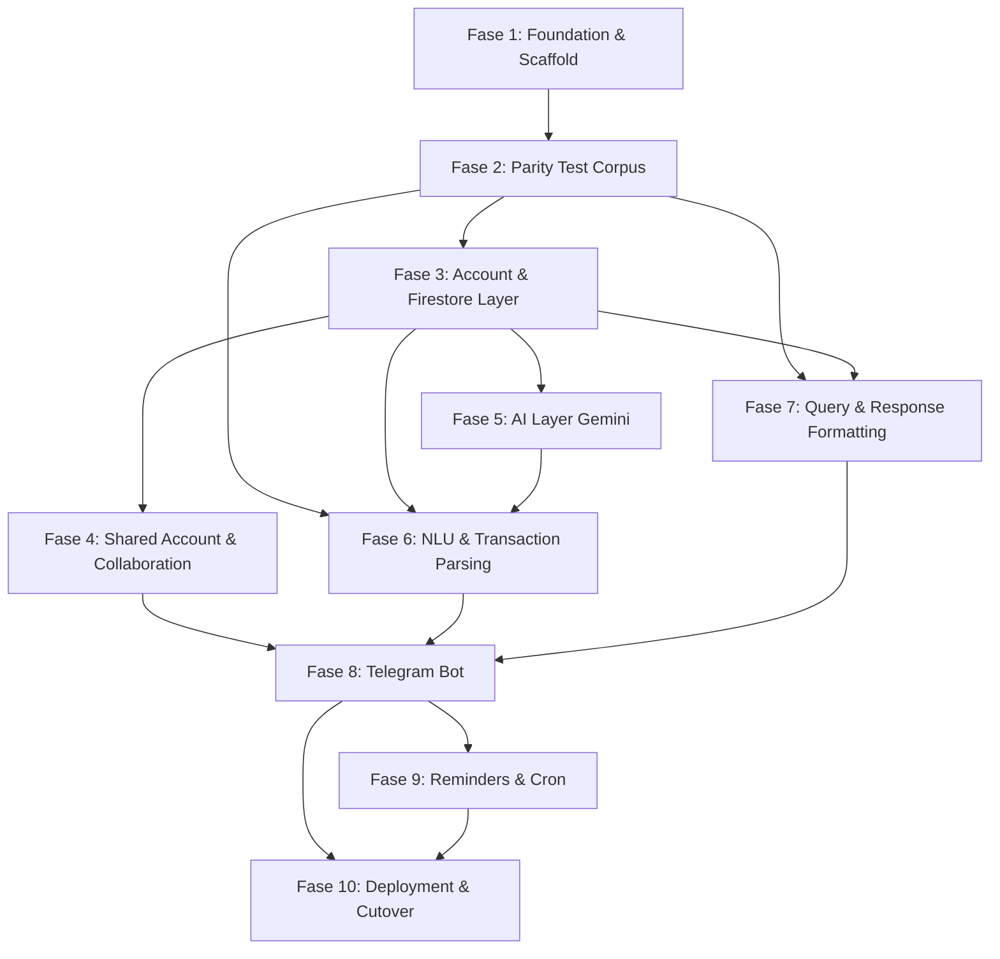
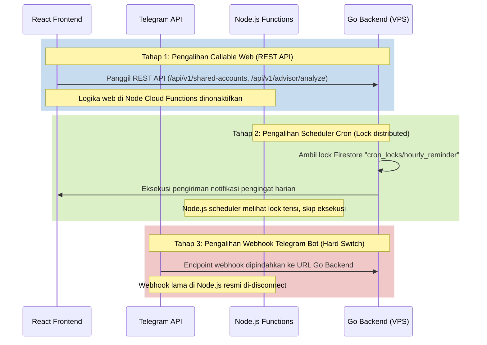

# Migration Plan: Node.js/Firebase-Functions to Go Backend

Dokumen ini berisi rencana eksekusi komprehensif fase demi fase untuk menulis ulang (rewrite) backend lama berbasis Node.js/Firebase Cloud Functions ke backend baru berbasis Go. Target dari rencana ini adalah memberikan panduan teknis yang sangat presisi bagi senior Go engineer atau AI agent untuk menyelesaikan implementasi tanpa kehilangan konteks bisnis atau detail teknis.

---

## 1. Ringkasan Eksekutif

Proses migrasi ini bertujuan untuk memindahkan seluruh logika bisnis backend dari Node.js (TypeScript) ke Go dengan tetap mempertahankan integritas data pada database Firestore yang sama tanpa melakukan migrasi skema database. Seluruh antarmuka web (React 19 frontend), autentikasi (Firebase Auth), dan penyimpanan aset (Firebase Storage) akan tetap berjalan seperti biasa.

Backend Go dirancang dengan kerangka kerja Gin Gonic, terstruktur secara modular dengan pembagian *domain* dan *module* (Vertical Slice), serta berjalan secara stateless.

### Status Saat Ini

Diperbarui: 30 Juli 2026.

| Fase | Status | Catatan |
| :--- | :--- | :--- |
| 1. Foundation & Scaffold | Selesai | Gin, config bertipe, Firebase SDK, middleware, envelope, rate limiter, datetime, money |
| 2. Parity Test Corpus | Selesai | 8 fixture, 299 kasus, di `testdata/parity/` |
| 3. Account & Firestore Access Layer | Sebagian | Path resolution 3 varian, permission model, cache kategori & creator name selesai. Repository transaksi belum |
| 4. Shared Account & Collaboration | Sebagian | Resumable copy job selesai. Fase cleanup, join/leave, invite code belum |
| 5. AI Layer (Gemini) | Sebagian | Client (vision, audio, insights) + quota rolling 24 jam selesai. Prompt & sintesis analisis belum |
| 6. NLU & Transaction Parsing | Selesai | Parser, guard, auto-save gate, intent classifier, semua terverifikasi fixture |
| 7. Query & Response Formatting | Sebagian | Query layer, sort, cap 30, escaping selesai. Sebagian template pesan belum |
| 8. Telegram Bot | Sebagian | Webhook + idempotency selesai. Router pesan, command, callback, session belum |
| 9. Reminders & Cron | Sebagian | Scheduler + leader lock selesai. Isi kedua job belum |
| 10. Deployment & Cutover | Belum | Dockerfile & compose siap, cutover belum dijalankan |

Endpoint yang logikanya belum diport sudah terdaftar dan memvalidasi input, lalu mengembalikan `501 NOT_IMPLEMENTED` beserta fase yang akan mengerjakannya. Tidak ada endpoint yang mengembalikan payload sukses palsu.

Gate verifikasi: `make verify` menjalankan `go vet`, `gofmt` check, build, `go test ./...`, dan `go test -race ./...`. Semuanya hijau pada commit terakhir.

### Rangkuman Estimasi Usaha
Migrasi direncanakan dalam 10 Fase berurutan. Total estimasi waktu pengerjaan adalah sekitar **17 hingga 27 hari kerja** bagi satu engineer, dengan ketergantungan kritis pada Fase 2 (penyusunan korpus pengujian paritas) sebagai fondasi validasi logika parsing dan NLU di fase-fase berikutnya.

---

## 2. Prinsip Migrasi

Rencana pemindahan backend ini wajib mengikuti aturan main (ground rules) berikut demi menjaga kestabilan sistem yang sedang berjalan di produksi:

1. **Tanpa Perubahan Perilaku Tanpa Keputusan Tertulis:** Logika bisnis yang lama harus di-porting persis apa adanya, kecuali untuk beberapa perbaikan bug teridentifikasi atau perubahan arsitektur yang sengaja disepakati (seperti penggantian OCR Tesseract menjadi Gemini Vision).
2. **Pengujian Paritas Berbasis Korpus (Golden Test Fixtures):** Sebelum menulis logika pemrosesan teks atau analisis keuangan di Go, buat terlebih dahulu korpus masukan dan luaran dari sistem lama (Node.js). Go harus menghasilkan luaran byte-for-byte yang sama untuk data masukan yang sama.
3. **Repositori Lama Bersifat Read-Only:** Repositori `/Users/mthidayat/Dev-Labs/dompet_cerdas` hanya digunakan sebagai referensi pembacaan kode sumber. Jangan melakukan modifikasi apa pun di direktori tersebut.
4. **Koeksistensi Selama Masa Transisi (Dual-Running):** Selama proses cutover, kedua backend akan berjalan bersamaan. Pemicu berbasis web (callable functions) akan dialihkan satu per satu secara bertahap, disusul scheduler cron, dan terakhir Telegram Bot.
5. **Skema Firestore Tidak Berubah:** Tidak ada migrasi database atau perubahan aturan penamaan dokumen. Backend Go harus menyesuaikan diri sepenuhnya dengan skema Firestore yang sudah ada.

---

## 3. Peta Modul: Old → New

Tabel di bawah memetakan setiap file TypeScript lama di `functions/src/` ke target package dan file baru di Go, lengkap dengan perkiraan LOC dan tingkat kesulitan porting.

| File TypeScript Lama | Ukuran (LOC) | Target Package / File Go | Tingkat Kesulitan | Keterangan |
| :--- | :--- | :--- | :--- | :--- |
| `bot/index.ts` | 2009 | `internal/modules/telegram/` | Critical | Logic utama bot, callback query router, state machine. |
| `services/nluService.ts` | 952 | `internal/modules/telegram/nlu.go` | High | Klasifikasi intent pesan text & regex parsing. |
| `index.ts` | 653 | `cmd/api/main.go`, `internal/modules/` | Medium | Entry point cloud functions, routing, wrapper callables. |
| `services/responseFormatter.ts` | 635 | `internal/modules/telegram/formatter.go` | Medium | Formatting Telegram HTML/Markdown, formatting mata uang. |
| `services/queryService.ts` | 631 | `internal/modules/transaction/query.go` | Medium | Firestore query builder, in-memory filter & sort. |
| `services/advisorService.ts` | 535 | `internal/modules/advisor/service.go` | High | Integrasi Gemini untuk saran finansial pengguna. |
| `services/transactionService.ts` | 445 | `internal/modules/transaction/service.go` | Medium | CRUD transaksi, pencarian kategori, invalidasi cache. |
| `services/webAnalysisService.ts` | 437 | `internal/modules/advisor/web_analysis.go` | High | Quota check (limit harian rolling 24 jam) & web scrape. |
| `services/transactionParsingService.ts` | 435 | `internal/modules/transaction/parser.go` | High | Parsing item, validasi regex, splitting multi-item. |
| `services/geminiService.ts` | 305 | `internal/shared/gemini/client.go` | Medium | Pembungkus Google Gemini SDK client. |
| `services/linkService.ts` | 295 | `internal/modules/telegram/link.go` | Low | Manajemen token verifikasi telegram link & soft delete link. |
| `services/sharedAccountService.ts` | 282 | `internal/modules/account/shared.go` | High | Logika copy-on-write subcollections untuk shared account. |
| `services/reminderService.ts` | 206 | `internal/modules/reminder/service.go` | High | Pengiriman reminder transaksi harian & rutinitas bulanan. |
| `services/accountService.ts` | 159 | `internal/modules/account/service.go` | Medium | Pencarian `AccountContext` (3-path resolution). |
| `services/storageService.ts` | 108 | `internal/shared/storage/storage.go` | Low | **Ported.** Pengunggahan foto struk ke Firebase Storage sebagai objek privat tanpa `makePublic` — divergensi disengaja, lihat ADR-017. |
| `bot/commands/help.ts` | 81 | `internal/modules/telegram/cmd_help.go` | Low | Handler perintah `/help` dan `/bantuan`. |
| `bot/commands/start.ts` | 68 | `internal/modules/telegram/cmd_start.go` | Low | Handler perintah `/start` dan `/link`. |
| `utils/crypto.ts` | 40 | `internal/shared/crypto/token.go` | Low | Helper generator token acak 32-karakter. |
| `utils/firestore.ts` | 36 | `internal/shared/db/firestore.go` | Low | Helper dasar pembacaan database. |
| `utils/date.ts` | 24 | `internal/shared/datetime/` | Low | Helper tanggal (sudah ter-porting di Fase 1). |
| `services/collaborationService.ts`| 33 | `internal/modules/account/collab.go` | Low | Helper relasi akun bersama. |
| `services/routerService.ts` | 138 | **DROPPED** | - | Tidak dipakai lagi (digantikan Google Gemini SDK langsung). |
| `services/ocrService.ts` | 36 | **DROPPED** | - | Tesseract.js di-drop, diganti Gemini Vision langsung. |

---

## 4. Fase Migrasi

Berikut adalah ketergantungan antar-fase dalam diagram di bawah:

---

### Fase 1 — Foundation & Scaffold (SELESAI)

* **Tujuan**: Membangun fondasi framework backend Go, middleware, standardisasi struktur folder, format respons, dan utilitas penanganan data sensitif (seperti rupiah dan datetime Jakarta) yang telah diuji validitasnya.
* **Prasyarat**: Tidak ada.
* **Unit Kerja**:
  * Seluruh boilerplate di `dompet_cerdas_go` termasuk `cmd/api/main.go`, `internal/config/config.go`, `internal/middleware/auth.go`, `internal/shared/datetime/jakarta.go`, `internal/shared/money/rupiah.go`, `Dockerfile`, dan `Makefile` sudah terimplementasi secara lengkap dan telah lolos uji build maupun tes unit.
* **Definition of Done**:
  * Porting dilarang menyentuh file fondasi ini lagi kecuali menambahkan mapping route di `main.go`.
* **Estimasi Effort**: 0 hari (Selesai).

---

### Fase 2 — Parity Test Corpus

* **Tujuan**: Mengumpulkan test fixtures (input dan output real) dari implementasi Node.js lama untuk memastikan logika parsing, intent NLU, formatting tanggal, parsing rupiah, dan Markdown escaping di backend Go menghasilkan nilai yang sama persis (paritas 100%).
* **Prasyarat**: Fase 1 (Selesai).
* **Unit Kerja**:

Lokasi fixture adalah `testdata/parity/` (konvensi Go: direktori bernama `testdata` diabaikan oleh toolchain). Spesifikasi skema JSON, daftar wart yang wajib di-pin, dan tabel nilai yang sudah terverifikasi ada di `docs/PARITY_CONTRACT.md`.

| # | File/Package | Deskripsi | Sumber TS | Risiko |
| :--- | :--- | :--- | :--- | :--- |
| 2.0 | `scripts/extract-fixtures.mjs` (di repo LAMA, jangan di-commit ke repo lama) | Harness Node yang meng-import fungsi TS terkompilasi lalu men-dump pasangan `{input, output}` ke JSON. Ini prasyarat semua unit di bawah: fixture harus hasil EKSEKUSI, bukan hasil membaca kode. | `functions/lib/**` | Meng-import dari `src` (TS) alih-alih `lib` (hasil build) menghasilkan error runtime; pastikan `npm run build` dijalankan lebih dulu. |
| 2.1 | `testdata/parity/nlu_intent.json` | Teks chat Telegram beserta `IntentType` dan parameter ter-ekstrak (timeRange, limit, sortBy, categoryFilter, specificDate). Wajib memuat kasus typo produksi (`transaski`, `transsaksi`, `tranaksi`, `transs`, `txs`) dan bentuk `show 10 last transs` yang jadi sumber bug v2.8.10. | `functions/src/services/nluService.ts` | Korpus yang tidak mewakili variasi input membuat intent tertentu tidak pernah teruji, dan divergensi baru terlihat di produksi. |
| 2.2 | `testdata/parity/transaction_parsing.json` | Input transaksi beserta hasil split multi-item, nominal, deskripsi, category hint, dan **status auto-save gate** (`shouldAutoSave` true/false). Wajib memuat keempat separator (`\n`, `;`, `,`, konjungsi) dan kasus yang harus DITOLAK parser (`10 trans terbesar`). | `functions/src/services/transactionParsingService.ts`, `bot/index.ts:240-251` | Gate auto-save yang lebih permisif di Go akan menulis transaksi salah tanpa konfirmasi user. Ini kelas bug terburuk di aplikasi ini. |
| 2.3 | `testdata/parity/markdown_escape.json` | Teks mentah dan hasil escaping. Catat: produksi memakai **Telegram Markdown V1** (`parse_mode: 'Markdown'`), bukan V2. Character class-nya memang berisi karakter khusus V2, tapi itu perilaku produksi yang harus dipertahankan apa adanya. | `functions/src/services/responseFormatter.ts:8-10` | Mengganti ke MarkdownV2 mengubah rendering seluruh pesan bot yang sudah berjalan. |
| 2.4 | `testdata/parity/date_range.json` | Pasangan `{spec, refDate}` → `{start, end}` untuk kedelapan spec. Berfungsi sebagai dokumentasi perilaku lama, termasuk bug `last_month` — nilai lama direkam, lalu ditandai sebagai divergensi yang disengaja (lihat ADR-012). | `functions/src/services/queryService.ts`, `functions/src/utils/date.ts` | Merekam bug lama sebagai ekspektasi Go akan mereproduksi range terbalik yang mengembalikan nol hasil. |
| 2.5 | `testdata/parity/amount_money.json` | Pasangan input→output untuk `parseAmountToken`, `formatRupiah`, dan `formatExactRupiah`. **Sudah terverifikasi** dengan menjalankan implementasi lama di Node; tabel nilainya ada di `docs/PARITY_CONTRACT.md` §4.1 dan §4.2, dan sudah tercermin di `internal/shared/money/rupiah_test.go`. Unit ini hanya memindahkan tabel tersebut ke berkas JSON agar konsisten dengan fixture lain. | `functions/src/services/transactionParsingService.ts:100-136`, `functions/src/services/responseFormatter.ts:284-299` | Rendah — sudah terverifikasi. |

* **Definition of Done**:
  * Berkas fixture `.json` tersimpan di `testdata/parity/` pada repositori `dompet_cerdas_go` dan ikut ter-commit.
  * Setiap fixture memuat metadata sumber (file + fungsi TS asal) sesuai skema di `docs/PARITY_CONTRACT.md`.
  * Fixture dihasilkan dengan MENJALANKAN kode lama, bukan menyalin ekspektasi hasil membaca kode.
  * Korpus NLU dan parsing mencakup minimal 50 skenario gabungan, termasuk seluruh kasus typo dan keempat separator multi-item.
  * `testdata/parity/transaction_parsing.json` memuat kolom `shouldAutoSave` untuk setiap kasus.
  * Harness ekstraksi tidak meninggalkan perubahan di repo lama (`git status` di `dompet_cerdas` tetap sesuai kondisi awal).
* **Estimasi Effort**: 2 hari kerja.
* **Catatan Blocking**: Fase ini memblokir Fase 6 dan Fase 7. Jangan menulis logika NLU, parser, atau formatter di Go sebelum fixture-nya ada.

---

### Fase 3 — Account & Firestore Access Layer

* **Tujuan**: Membangun mekanisme resolusi path dokumen Firestore berdasarkan konteks akses (legacy, private, shared) dan mengimplementasikan repository database beserta category cache dengan invalidasi manual.
* **Prasyarat**: Fase 1 (Selesai).
* **Unit Kerja**:

| # | File/Package | Deskripsi | Sumber TS | Risiko |
| :--- | :--- | :--- | :--- | :--- |
| 3.1 | `internal/modules/account/repository.go` | Implementasi pencarian konteks subkoleksi melalui `getAccountContext(userId, preferredAccountId)` untuk 3 path (legacy, private, shared). Membedakan nama koleksi `simulations` pada legacy vs `plans` pada private/shared. | `functions/src/services/accountService.ts` | Salah membaca atau menulis lokasi koleksi data keuangan pengguna (membaca legacy padahal private, atau sebaliknya). |
| 3.2 | `internal/modules/account/category_cache.go` | Category cache berbasis memory (`Map`) ter-key `${userId}:${accountId\|'legacy'}` dengan TTL 24 jam. Menyediakan mekanisme invalidasi paksa yang dipanggil oleh handler `refreshCategoryCache`. | `functions/src/services/transactionService.ts:13-14` | Data kategori basi di memori Go yang berumur panjang jika refresh request gagal diproses. |
| 3.3 | `internal/modules/account/creator_cache.go` | Cache untuk nama pembuat transaksi (`creatorNameCache`) berbasis memori tanpa TTL. | `functions/src/services/transactionService.ts:15` | Memory leak jika jumlah user membesar tanpa batas atas penyimpanan cache nama. |

* **Definition of Done**:
  * Kode `repository.go` dan `category_cache.go` selesai ditulis di package `internal/modules/account/`.
  * Tes unit `account_context_test.go` memverifikasi ketepatan 3-path resolution untuk input legacy, private, dan shared account.
  * Tes unit `category_cache_test.go` membuktikan cache kedaluwarsa setelah TTL habis atau saat di-invalidate paksa.
  * Perintah `go test ./internal/modules/account/...` berjalan sukses tanpa error.
* **Estimasi Effort**: 3 hari kerja.

---

### Fase 4 — Shared Account & Collaboration

* **Tujuan**: Mengimplementasikan endpoint kolaborasi akun bersama, proses konversi akun personal ke akun bersama secara aman (copy-then-soft-cutover), dan penegakan izin akses di sisi server backend Go.
* **Prasyarat**: Fase 3.
* **Unit Kerja**:

| # | File/Package | Deskripsi | Sumber TS | Risiko |
| :--- | :--- | :--- | :--- | :--- |
| 4.1 | `internal/modules/account/shared_handler.go` | Mendaftarkan route REST: `POST /api/v1/shared-accounts` (create), `DELETE /api/v1/shared-accounts/:id/access` (delete access), `POST /api/v1/shared-accounts/:id/invite-code` (invite code), dan `POST /api/v1/shared-accounts/join` (join). | `functions/src/index.ts` (callables), `functions/src/services/sharedAccountService.ts` | Kebocoran token auth atau kode undangan tidak tervalidasi dengan benar. |
| 4.2 | `internal/modules/account/converter.go` | Porting logika `shareExistingAccount` (`POST /api/v1/shared-accounts/convert`) dengan membagi proses menjadi 3 tahap: copy 6 subkoleksi (`categories`, `transactions`, `plans`, `budgets`, `simulations`, `debts`) dengan batch size 400, verifikasi kecocokan record, lalu hapus sumber data lama. Jika gagal di tengah jalan, status ditandai agar bisa di-resume, bukan di-rollback destruktif. | `functions/src/services/sharedAccountService.ts` | Data hilang atau duplikat akibat kegagalan koneksi di tengah-tengah proses batch copy 400 record. |
| 4.3 | `internal/modules/account/permission.go` | Logika otorisasi transaksi akun bersama: owner memiliki hak penuh, sedangkan member hanya bisa mengedit/menghapus record dengan `createdByUserId == uid`. Record legacy (tanpa UID) hanya bisa diubah oleh owner. | `functions/src/services/collaborationService.ts` | Member biasa dapat mengubah atau menghapus data milik owner akibat celah bypass permission server-side. |

* **Definition of Done**:
  * Kode handler, logic converter, dan middleware permission terbuat di folder `internal/modules/account/`.
  * Tes integrasi `converter_test.go` menyimulasikan konversi dengan menyalin data mock di emulator Firestore dan memverifikasi data di-resume dengan benar saat terjadi interupsi.
  * Tes unit `permission_test.go` memverifikasi penolakan aksi hapus transaksi milik owner oleh pengguna bertipe member.
* **Estimasi Effort**: 4 hari kerja.

---

### Fase 5 — AI Layer (Gemini)

* **Tujuan**: Mengintegrasikan SDK resmi Google Gemini untuk modul financial advisor dan analisis bukti transaksi (Gemini Vision) serta mengimplementasikan pembatasan kuota token harian yang berbasis rolling 24 jam dengan penghitungan token riil.
* **Prasyarat**: Fase 3.
* **Unit Kerja**:

| # | File/Package | Deskripsi | Sumber TS | Risiko |
| :--- | :--- | :--- | :--- | :--- |
| 5.1 | `internal/shared/gemini/client.go` | Setup client SDK `google.golang.org/genai` dengan model `gemini-2.5-flash`. Mengganti fungsi wrapper client lama. | `functions/src/services/geminiService.ts` | Kegagalan inisialisasi API key Gemini saat startup server. |
| 5.2 | `internal/modules/advisor/handler.go` | Route `POST /api/v1/advisor/analyze` untuk memproses prompt keuangan personal dan menghasilkan saran keuangan. | `functions/src/services/advisorService.ts` | Model melantur (hallucination) memberikan analisis angka keuangan yang salah atau tidak logis. |
| 5.3 | `internal/modules/advisor/quota.go` | Implementasi limitasi kuota harian rolling 24 jam di Firestore (`web_ai_limits/{userId}`) menggunakan skema `runTransaction`. Menyimpan token reservasi (estimasi 3500 prompt + 1200 response), kemudian memperbaruinya setelah model selesai dieksekusi dengan metadata token riil dari Gemini SDK (`UsageMetadata`). | `functions/src/services/webAnalysisService.ts` | Kuota bocor akibat race condition pemanggilan paralel tanpa Firestore transaction lock. |
| 5.4 | `internal/modules/transaction/ocr.go` | Logika pemrosesan gambar struk belanja menggunakan Gemini Vision langsung. Menggunakan helper CGO-free `github.com/disintegration/imaging` untuk me-resize gambar ke lebar maksimal 1200px sebelum dikirim ke Gemini. | `functions/src/services/ocrService.ts` | Biaya API membengkak akibat pengiriman gambar resolusi penuh tanpa resize yang optimal. |

* **Definition of Done**:
  * Berhasil terintegrasi dengan package resmi `google.golang.org/genai`.
  * Tes integrasi `quota_test.go` membuktikan transaksi Firestore berhasil me-reset limit saat melewati batas rolling 24 jam (86.400.000 ms).
  * Tes unit `ocr_test.go` membuktikan resize gambar bekerja dengan file gambar dummy tanpa ketergantungan library CGO.
* **Estimasi Effort**: 3 hari kerja.

---

### Fase 6 — NLU & Transaction Parsing

* **Tujuan**: Mengimplementasikan parser teks transaksi, intent classification berbasis NLP/Regex lokal, penanganan session berbasis timeout, dan auto-save gate aman yang meminimalkan penulisan transaksi salah.
* **Prasyarat**: Fase 2, Fase 3, Fase 5.
* **Unit Kerja**:

| # | File/Package | Deskripsi | Sumber TS | Risiko |
| :--- | :--- | :--- | :--- | :--- |
| 6.1 | `internal/modules/telegram/nlu.go` | Klasifikasi intent pesan chat Telegram (`IntentType`) menggunakan regex terkompilasi (inventory regex lokal) dan fallback LLM. | `functions/src/services/nluService.ts` | Inkonsistensi kompilasi pola regex di library bawaan Go (`regexp` menggunakan sintaks RE2) dibandingkan regex JavaScript (misalnya hilangnya dukungan lookaround). |
| 6.2 | `internal/modules/transaction/parser.go` | Logika ekstraksi teks transaksi menjadi item data terstruktur (jumlah uang, nama item, kategori). Mendukung pemecahan input multi-item dalam satu pesan chat. | `functions/src/services/transactionParsingService.ts` | Kegagalan mendeteksi nominal rupiah berakhiran huruf ribu/jt (misalnya "5rb" atau "10juta") akibat parser Go tidak sinkron dengan parser Node lama. |
| 6.3 | `internal/modules/telegram/session.go` | Manajemen stateful session berbasis Firestore untuk input teks transaksi (`text_transaction_sessions` dengan TTL 30 menit) dan struk belanja (`receipt_sessions` dengan TTL 5 menit). | `functions/src/bot/index.ts` | Session tetap menggantung aktif melebihi batas kedaluwarsa karena kegagalan pembersihan data dari backend. |
| 6.4 | `internal/modules/transaction/autosave.go` | Logika `shouldAutoSaveText` untuk mendeteksi transaksi yang bisa disimpan langsung tanpa konfirmasi tombol Telegram. Hanya berlaku jika: tepat 1 item transaksi, parsing berhasil via regex lokal (bukan LLM), dan penentuan kategori sukses tanpa bantuan LLM. Menambahkan structured audit logging saat aksi auto-save terpicu. | `functions/src/bot/index.ts:240-251` | Transaksi salah terlanjur tersimpan diam-diam (silent write) akibat false positive pada filter deteksi regex. |

* **Definition of Done**:
  * Seluruh data uji di `nlu_corpus.json` dan `parsing_corpus.json` (dari Fase 2) berhasil lolos validasi pengujian unit di `nlu_test.go` dan `parser_test.go` dengan paritas 100%.
  * Logika auto-save gate diuji dengan skenario bernilai true/false di `autosave_test.go` dan memverifikasi log audit ter-slog dengan level `INFO` atau `WARN`.
* **Estimasi Effort**: 4 hari kerja.

---

### Fase 7 — Query & Response Formatting

* **Tujuan**: Mengimplementasikan database query builder transaksi finansial di Firestore (dengan batasan maksimal 30 item di Telegram) serta response formatter yang memformat keluaran teks ke Telegram Markdown V1.
* **Prasyarat**: Fase 2, Fase 3.
* **Unit Kerja**:

| # | File/Package | Deskripsi | Sumber TS | Risiko |
| :--- | :--- | :--- | :--- | :--- |
| 7.1 | `internal/modules/transaction/query.go` | Query builder transaksi. Hanya field `date` (range tanggal) yang dikirim ke query level database Firestore. Filter kategori, tipe, sorting (`amount` desc atau `date` desc + `createdAt` desc), dan limitasi (cap 30 item untuk Telegram) dilakukan secara in-memory di Go. | `functions/src/services/queryService.ts` | Latensi backend tinggi jika data transaksi user berukuran sangat besar dibaca seluruhnya ke memori server Go. |
| 7.2 | `internal/modules/telegram/formatter.go` | Formatting text output bot Telegram memakai **Markdown V1** (`parse_mode: 'Markdown'`), sesuai produksi. Port `escapeMarkdown` apa adanya dari `responseFormatter.ts:8-10`, termasuk character class-nya yang berisi karakter khusus V2 — itu perilaku produksi, bukan bug yang perlu dirapikan. Sertakan penanganan nilai kosong (`null`/`undefined` → string kosong). | `functions/src/services/responseFormatter.ts:8-10, 284-299` | Mengganti ke MarkdownV2 mengubah rendering seluruh pesan bot yang sudah berjalan. Nominal rupiah mengandung `.` dan `-` yang harus ter-escape identik dengan produksi. |

* **Definition of Done**:
  * Seluruh data uji di `testdata/parity/markdown_escape.json` lolos verifikasi pada tes unit `formatter_test.go`.
  * `parse_mode` yang dipakai adalah `Markdown` (V1), diverifikasi lewat grep tidak ada kemunculan `MarkdownV2` di seluruh package.
  * Tes unit `query_test.go` memverifikasi sorting in-memory bekerja presisi seperti perilaku lama: `amount` desc bila `sortBy=="amount"`, selain itu `date` desc lalu `createdAt` desc.
  * Cap 30 item terverifikasi lewat tes dengan dataset lebih dari 30 transaksi.
* **Estimasi Effort**: 2 hari kerja.

---

### Fase 8 — Telegram Bot

* **Tujuan**: Menghubungkan engine Telegram Bot, mendaftarkan route endpoint webhook, menangani validasi idempotensi update ID telegram, dan mendistribusikan callback query atau command teks ke handler masing-masing.
* **Prasyarat**: Fase 4, Fase 6, Fase 7.
* **Unit Kerja**:

| # | File/Package | Deskripsi | Sumber TS | Risiko |
| :--- | :--- | :--- | :--- | :--- |
| 8.1 | `internal/modules/telegram/webhook.go` | Route endpoint `POST /api/v1/telegram/webhook` (public). Mengecek token rahasia Telegram di header request sebelum memproses data payload update Telegram. | `functions/src/index.ts` | Percobaan spamming data palsu dari pihak luar yang menembak langsung ke IP backend. |
| 8.2 | `internal/modules/telegram/idempotency.go` | Logika pencegahan double-processing update ID Telegram. Setiap kali webhook terpanggil, buat dokumen baru di `telegram_processed_updates/{update_id}`. Jika mengembalikan error status `ALREADY_EXISTS` (gRPC code 6), kembalikan respons HTTP 200 OK secara instan ke server Telegram tanpa memproses isi chat. | `functions/src/index.ts:54-89` | Pesan yang sama diproses berulang kali (double insert) ketika server Telegram mencoba me-retry webhook akibat timeout koneksi. |
| 8.3 | `internal/modules/telegram/callback_router.go`| Parser dan dispatcher callback query Telegram dengan awalan prefix spesifik: `confirm_unlink`, `cancel_unlink`, `switch_account:`, `mtc_`, `mtx_`, `mtr_`, `c_`, dan `x_`. | `functions/src/bot/index.ts` | Aksi tombol inline Telegram tidak merespons akibat kegagalan parsing data callback string. |
| 8.4 | `internal/modules/telegram/command_handlers.go`| Implementasi handler command teks: `/start`, `/help` (atau `/bantuan`), `/link` (atau `/hubungkan`), `/akun`, dan `/unlink` (atau `/disconnect`). | `functions/src/bot/commands/` | Pesan error tidak bersahabat dikirimkan ke user jika parameter command tidak valid. |

* **Definition of Done**:
  * Integration test `webhook_test.go` membuktikan request dengan header token salah ditolak dengan status HTTP 401 Unauthorized.
  * Tes unit `idempotency_test.go` membuktikan penolakan update ID ganda pada level database Firestore.
  * Router callback dan command handlers terdaftar lengkap di `internal/modules/telegram/`.
* **Estimasi Effort**: 4 hari kerja.

---

### Fase 9 — Reminders & Cron

* **Tujuan**: Mengimplementasikan scheduler cron harian dan bulanan untuk mengirim notifikasi pengingat transaksi serta menerapkan leader locking di level Firestore untuk menghindari duplikasi eksekusi.
* **Prasyarat**: Fase 8.
* **Unit Kerja**:

| # | File/Package | Deskripsi | Sumber TS | Risiko |
| :--- | :--- | :--- | :--- | :--- |
| 9.1 | `internal/modules/reminder/lock.go` | Mekanisme lock terdistribusi berbasis Firestore. Sebelum cron berjalan, Go mencoba menulis dokumen lock `cron_locks/hourly_reminder` berisi metadata `lockedBy` (pod/instance ID) dan `lockedAt`. Lock valid selama maksimal 10 menit. | Baru (Opsional di Node, Wajib untuk Dual-Running Go) | Dua backend (Go dan Node.js lama) mengeksekusi reminder di jam yang sama sehingga notifikasi terkirim ganda ke user. |
| 9.2 | `internal/modules/reminder/routine.go` | Implementasi `processRoutineExpenseReminders()` yang memindai koleksi grup `routine_expenses` dengan filter `reminderEnabled == true`. Mencocokkan tipe pengingat (`AWAL_BULAN`, `AKHIR_BULAN`, `CUSTOM` dengan fallback tanggal 30 jika bulan pendek memiliki tanggal 31) dan mencocokkan jam Jakarta saat ini (`HH:00`). | `functions/src/services/reminderService.ts` | Reminder tidak terkirim di hari terakhir bulan pendek karena logika pencocokan tanggal 31 tidak memiliki fallback. |
| 9.3 | `internal/modules/reminder/daily.go` | Implementasi `processDailyNoTransactionReminders()`. Mengambil seluruh data `telegram_link` secara in-memory (collectionGroup query tanpa index composite) lalu memfilter user aktif. Memeriksa apakah user sudah mencatat transaksi hari ini untuk memicu alarm pengingat. | `functions/src/services/reminderService.ts` | Performansi menurun tajam (O(N) data scan) seiring bertambahnya jumlah user yang menghubungkan akun Telegram. |

* **Definition of Done**:
  * Pemicu lock berhasil diuji di `lock_test.go` dengan menyimulasikan bentrokan dua instansi scheduler.
  * Tes unit `routine_test.go` memastikan penanganan tanggal 31 di bulan Februari/April bekerja tepat sasaran (reminder terkirim di hari terakhir bulan berjalan).
  * Cron scheduler terintegrasi di skeleton runtime `cmd/api/main.go`.
* **Estimasi Effort**: 3 hari kerja.

---

### Fase 10 — Deployment & Cutover

* **Tujuan**: Membangun konfigurasi deployment container, mengalihkan integrasi web frontend secara bertahap, memindahkan webhook Telegram, dan menyiapkan skema fallback rollback jika terdeteksi masalah pasca-rilis.
* **Prasyarat**: Fase 5, Fase 8, Fase 9.
* **Unit Kerja**:

| # | File/Package | Deskripsi | Sumber TS | Risiko |
| :--- | :--- | :--- | :--- | :--- |
| 10.1 | Deployment Config | Pembuatan manifest Docker multi-stage (tzdata terinstal, user non-root), docker-compose, dan Nginx/Traefik reverse proxy config untuk VPS target. | `Dockerfile`, `docker-compose.yml` (Fase 1 Boilerplate) | Kebocoran hak akses root container di server VPS hosting. |
| 10.2 | Frontend Redirect | Mengubah kode React frontend di `/Users/mthidayat/Dev-Labs/dompet_cerdas` (khusus pemanggilan REST endpoint) dari yang sebelumnya menggunakan wrapper SDK `httpsCallable` milik Firebase ke pemanggilan standar API server Go menggunakan REST `fetch()`. | `src/services/firebaseRuntime.ts` | Kegagalan parsing data di frontend karena struktur amplop data (envelope) REST Go sedikit bergeser dari format callable Firebase. |

* **Definition of Done**:
  * Docker image berhasil dibuild dan dijalankan secara lokal dengan file `.env` produksi tiruan.
  * Frontend React berhasil terhubung ke server Go lokal saat emulator Firestore diaktifkan.
* **Estimasi Effort**: 2 hari kerja.

---

## 5. Urutan Cutover Produksi

Proses migrasi dari Cloud Functions Node.js ke Go di server produksi wajib dilakukan secara bertahap dalam 3 tahap berurutan guna meminimalkan downtime dan mencegah duplikasi data transaksi atau pengiriman pesan notifikasi berulang.

### Tahap 1: Pengalihan Web Callables (REST API)
1. Jalankan Go Backend di server VPS produksi (port `8080`).
2. Deploy perubahan frontend React yang mengarahkan endpoint `httpsCallable` lama ke endpoint REST API Go Backend yang baru.
3. Seluruh REST API Go kini melayani transaksi web (pembuatan akun bersama, analisis keuangan Gemini, scan struk belanja).
4. Node.js Cloud Functions untuk callable web dinonaktifkan (atau dibiarkan aktif tanpa trafik masuk).

### Tahap 2: Pengalihan Scheduler Cron
1. Scheduler Cron di Go Backend diaktifkan.
2. Go Backend akan bersaing mendapatkan lock di Firestore pada dokumen `cron_locks/hourly_reminder`.
3. Selama masa transisi, jika Go Backend memenangkan lock, cron Node.js yang berjalan paralel di Cloud Functions akan melewati (skip) pengiriman reminder.
4. Setelah dipastikan aman dalam 3 siklus eksekusi (3 jam), matikan trigger Cloud Scheduler Firebase yang mengarah ke Node.js Cloud Functions.

### Tahap 3: Pengalihan Webhook Telegram Bot (Hard Switch)
*Telegram hanya mengizinkan satu webhook URL aktif per bot API Token.*
1. Lakukan pengalihan dengan menembak API Telegram:
   `POST https://api.telegram.org/bot<TOKEN>/setWebhook?url=https://<DOMAIN_BARU>/api/v1/telegram/webhook`
2. Pemicu bot seketika berpindah ke VPS Go.
3. **Mekanisme Rollback Instan**: Jika bot Go mengalami kendala crash atau tidak merespons, kembalikan webhook ke URL Cloud Function Node.js lama:
   `POST https://api.telegram.org/bot<TOKEN>/setWebhook?url=https://<DOMAIN_LAMA>/telegramWebhook`

### Indikator Pemicu Rollback (Rollback Triggers)
Kembalikan trafik ke backend Node.js lama secara penuh jika ditemukan kondisi berikut dalam kurun waktu 1 jam setelah migrasi:
* Tingkat kegagalan error HTTP 5xx di Go Backend melampaui **5%** dari total trafik masuk.
* Antrean pesan Telegram menggantung di server Telegram (nilai `pending_update_count` pada respon `getWebhookInfo` naik terus menerus dan bot tidak membalas chat lebih dari 5 menit).
* Terjadi indikasi data transaksi ganda di Firestore atau korupsi data saat konversi shared-account dilakukan.

---

## 6. Risiko & Mitigasi

| Risiko | Dampak | Probabilitas | Mitigasi |
| :--- | :--- | :--- | :--- |
| **Divergensi Logika Regex & NLU** | Transaksi gagal ter-parse di Go padahal sukses di Node.js. | Medium | Gunakan korpus uji paritas (Fase 2) secara ketat di tes unit Go untuk memverifikasi setiap kecocokan sintaks regex RE2. |
| **False Positive Auto-Save Gate** | Transaksi salah tersimpan ke Firestore secara diam-diam tanpa konfirmasi tombol. | Low | Batasi ketat auto-save hanya untuk item tunggal dari regex lokal (tanpa LLM). Tambahkan logging log audit slog `WARN` setiap kali auto-save dipicu untuk debugging cepat. |
| **Korupsi Data Shared-Account** | Data hilang di tengah jalan saat konversi batch copy-delete 400 record. | Low | Terapkan pola *resumable job*. Jangan hapus data private sumber sebelum seluruh 6 subkoleksi selesai divalidasi tercopy dengan sempurna ke path `sharedAccounts/`. |
| **Pembengkakan Biaya Token AI** | Kuota rolling harian jebol karena salah menghitung token. | Medium | Jangan gunakan penghitungan kasar `Math.ceil(length/4)`. Ambil metadata token penggunaan riil (`UsageMetadata`) yang dikembalikan oleh respons Gemini SDK. |
| **Akurasi OCR Menurun** | Gemini Vision gagal mengenali angka struk belanja dibanding pipeline Tesseract lama. | Medium | Kirimkan gambar hasil resize berkualitas tinggi (progressive JPEG q80) dan susun instruksi prompt Gemini Vision yang terstruktur untuk mengembalikan format JSON yang ketat. |
| **Kategori Cache Basi** | User membuat kategori baru di frontend tapi transaksi bot Telegram masih membaca kategori lama dari cache Go. | High | Endpoint `/api/v1/categories/refresh-cache` harus dipanggil frontend secara realtime untuk menghapus entry di memory map Go saat user mengubah kategori. |
| **Kinerja Reminder Cron Drop** | Pemindaian `telegram_link` secara menyeluruh membebani memori backend Go. | Low | Tambahkan catatan optimasi skalabilitas di kode Go. Di masa mendatang, pecah query per-kumpulan dokumen (batching) atau migrasikan ke indexing Firestore yang tepat guna menghindari in-memory scan berskala besar. |
| **Ketidakcocokan Timezone** | Selisih waktu pencatatan transaksi (UTC vs Asia/Jakarta WIB). | Medium | Seluruh instance waktu wajib melewati helper `jakarta.go` yang memaksa pemanggilan zona waktu Asia/Jakarta sebelum melakukan formatting string tanggal. |
| **Kebocoran Bukti Bayar** | Bukti bayar struk transaksi dapat dibaca publik secara bebas di internet. | High | Metode `makePublic()` pada Firebase Storage bucket perlu ditinjau kembali di sisi manajerial keamanan. Backend Go harus menyiapkan flag akses privat ter-presigned URL di masa depan jika privasi data transaksi ingin ditingkatkan. |

---

## 7. Perbedaan Perilaku yang Disengaja

Bagian ini mencatat beberapa penyesuaian fungsional backend Go yang sengaja dirancang berbeda demi perbaikan kualitas sistem:

| Perilaku Backend Lama (Node.js) | Perilaku Backend Baru (Go) | Alasan & Justifikasi |
| :--- | :--- | :--- |
| Bug rollover tanggal `last_month` di tanggal 31 Maret menghasilkan range terbalik ke Februari karena perhitungan date JavaScript. | Menggunakan helper `jakarta.go` yang memotong tanggal secara aman dan mengembalikan range awal-akhir bulan yang presisi. | Perbaikan bug kalkulasi finansial bulanan pengguna. |
| Penghitungan token AI bersifat estimasi kasar dengan membagi panjang karakter input dengan angka 4 (`Math.ceil(length/4)`). | Menggunakan properti `UsageMetadata` riil dari Google Gemini API SDK. | Menghindari bias alokasi kuota rolling pengguna dan menghemat biaya operasional API. |
| Pipeline ekstraksi struk belanja menggunakan Tesseract WASM lokal dilanjutkan parsing teks oleh LLM. | Langsung memproses gambar struk belanja menggunakan fitur multimodal Gemini Vision. | Menyederhanakan dependensi backend Go, menghilangkan kompilasi binary CGO, dan meningkatkan akurasi data. |
| Rate limiter in-memory gampang ter-bypass karena server Cloud Functions sering cold start (reset global state). | Rate limiter Go berjalan persisten di dalam memory server VPS yang menyala terus menerus. | Menegakkan batasan request secara konsisten untuk meredam serangan spamming. |
| Konversi shared-account langsung menghapus data sumber seketika saat menyalin data. | Menggunakan pola penyalinan aman (copy-then-soft-cutover) dan data lama baru dihapus setelah validasi copy selesai 100%. | Mencegah kehilangan data transaksi jika koneksi database terputus di tengah jalan. |

---

## 8. Referensi

* **Dokumen Keputusan Arsitektur**: `docs/DECISIONS.md` (Berisi alasan drop library Tesseract, integrasi Gemini Vision, dll)
* **Dokumen Kontrak Paritas**: `docs/PARITY_CONTRACT.md` (Detail format file JSON korpus dan tata cara eksekusi golden tests)
* **Repositori Lama (Ref)**: `/Users/mthidayat/Dev-Labs/dompet_cerdas`
  * Dokumentasi Integrasi Telegram: `functions/DOKUMENTASI_LENGKAP.md`
  * Panduan Pengujian: `TESTING.md`
  * Flow Telegram Bot detail: `docs/TELEGRAM_INTEGRATION.md`
* **Repositori Baru (Go)**: `/Users/mthidayat/Dev-Labs/dompet_cerdas_go`
  * README Pengembangan Lokal: `README.md`
  * Konfigurasi Environment: `.env.example`

---
🤖 Generated with [opencode](https://opencode.ai/)
